# Contract Vulnerabilities Summary

**Exercise 1:** Attacker can perform a Denial of Service attack by spamming the `Store::store()` function, increasing the `Store::safes` array length and increase the gas fees so high that no other user can interact with it  . 
 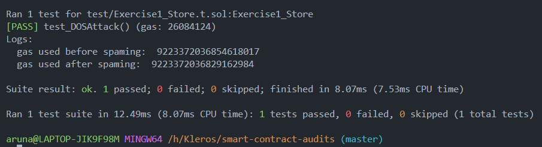 

**Exercise 2:** There is a roundoff error while calculating `basePrice / (1 + objectBought)`. Just after 2 rounds, the discounted price becomes `33333333333333333` which is NOT equal to 1 ETH after multiplying it with `3` and hence the contract returns a revert. 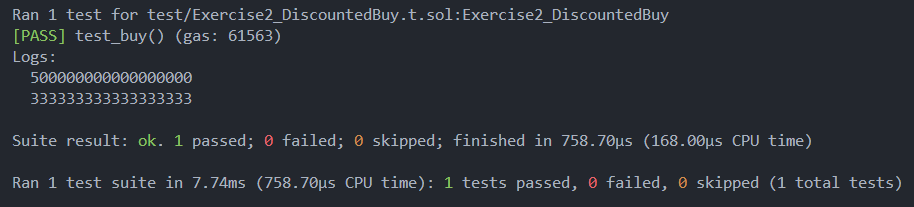

**Exercise 3:** Private variables `(HeadOrTail::lastChoiceHead)`, can easily be fetched using RPC calls or using packages like `ethers.js` or `web3.js` Attacker can also eassily access it, and cast the same choice as the first player, winning everytime. 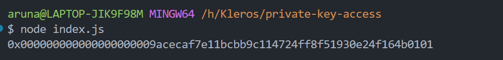

**Exercise 4:** Re-erancy attack can be executed on `Vault::redeem()` function. 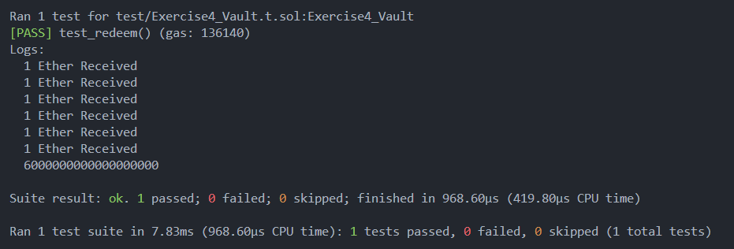

**Exercise 5:** 
1. Attacker can use self destruct to transfer 1 ETH to the contract and call `HeadOrTail::timeOut()` function even without calling `HeadOrTail::guess()`. This will transfer 2 ETH to the attacker contract.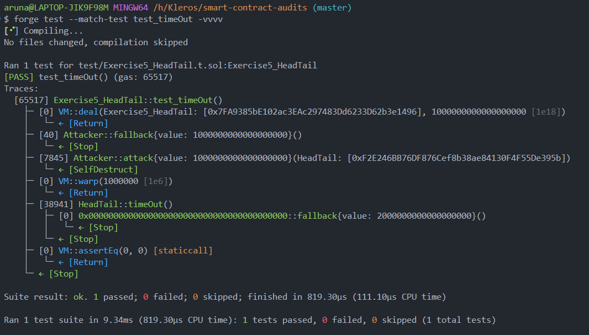
2. This contract has a `Frontrunning` vulnerability. After the `partyA` initializes the contract, the attacker can use a `selfDestruct()` to send 1 ETH to the contract. If `partyA` executes `HeadOrTail::resolve()`, the attacker can frontrun the transaction, get the value in `_chooseHead`, and execute `HeadOrTail::guess()` function. This will make partyB the winner.
   
**Exercise 6:** The use of `int` data type is a vulnerability here. Attacker can pass a negative value, which will result in addition in own account and negative balance for the receiver. 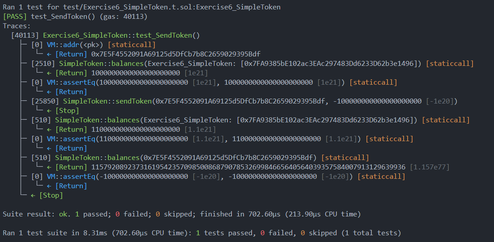

**Exercise 7:** There is a logical vulnerability here. If I buy `1e18`, then as per the calculation here `uint ethToReceive = ((1e18 + totalSupply) * _amount) / 1e18`, my ethToReceive will be `2e18` where the supply is still `1e18`. 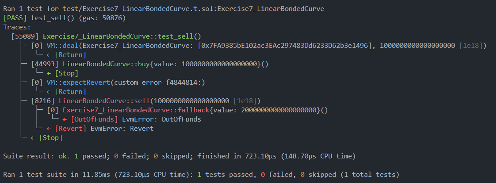

**Exercise 8:** There is no way to reset the storage slot and therefore 1 ether always remains. `Coffers::closeAccount()` does not clear the balance in slots mapping, so attacker can execute `Coffers::closeAccount()` then `Coffers::createAccount()`  and again `Coffers::closeAccount()` to withdraw extra ETH without any deposit. 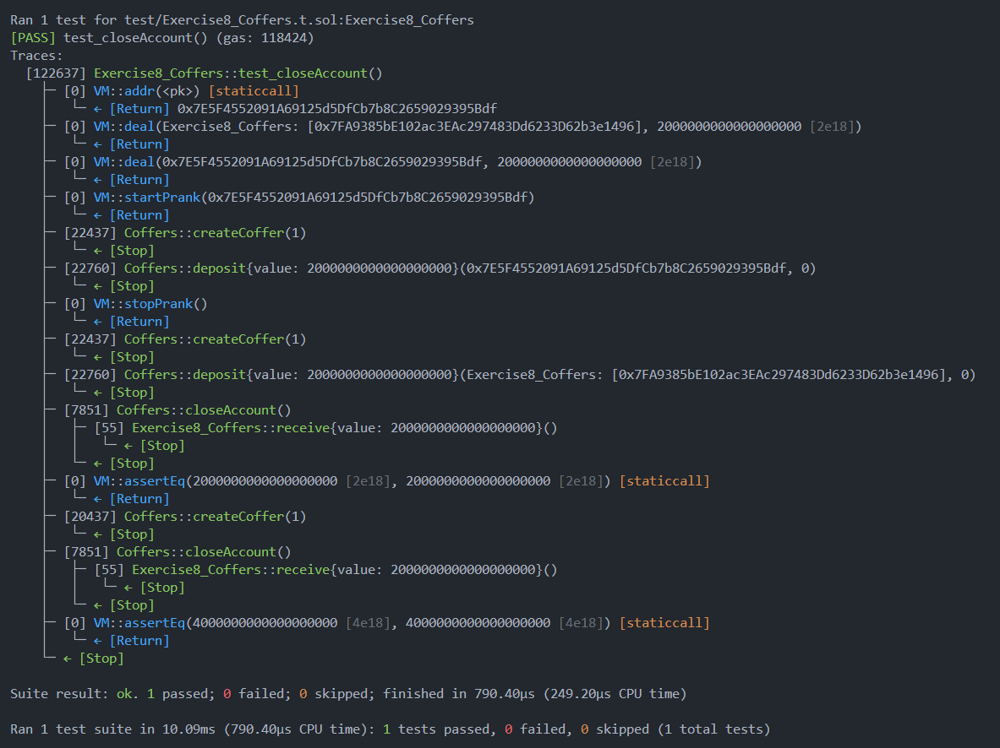

**Exercise 9:** Attacker can choose a value for `_amount` in a way that `(scalingFactor * _amount) < contractBalance` which will result in `CommonCoffers::toRemove` to become 0 and therefore it will not afeect the balance of attacker in the coffers mapping while executing `CommonCoffers::withdraw()`. 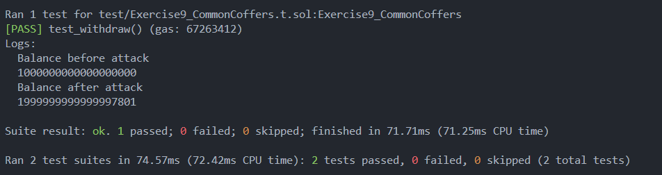

**Exercise 10:** Attacker can prevent other users to get their reward by participating in the game through a smart contract without a receive or fallback function instead of a wallet. 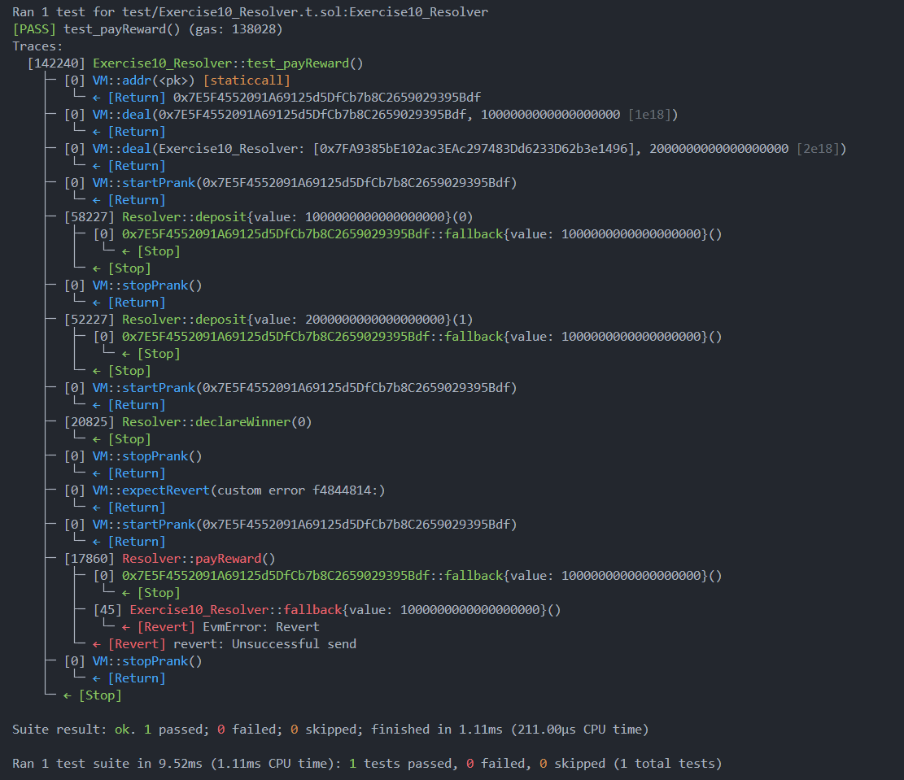

**Exercise 11:** There is a vulnerability caused while calculating `ID` using `keccak256(abi.encodePacked(_name, _surname, _nonce))`. `keccak256(abi.encodPacked(“abc”, “def” , 1)) == keccak256(abi.encodePacked(“ab”, “cdef” , 1))` which means that same `ID` will be generated for different inputs causing a collision. 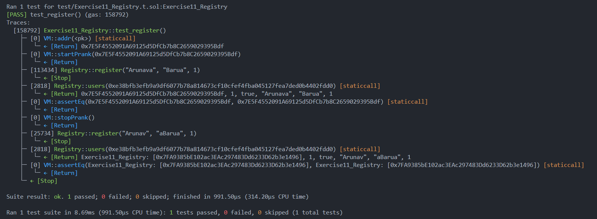

**Exercise 12:** A user can tranfer funds to their own wallet and the balance will increase as there is `no require statements` to check `msg.sender` and `_to` address. 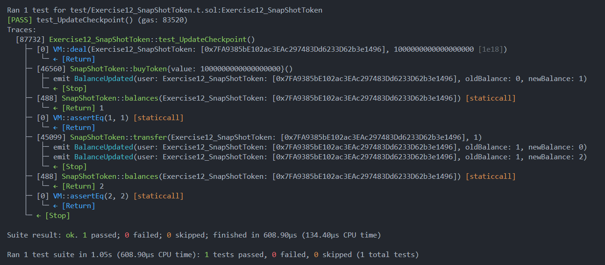

**Exercise 13:**

**Exercise 14:** An attacker can use a `self-destruct` to increase the balance of `PiggyBank` smart contract locking everyone's money in it. 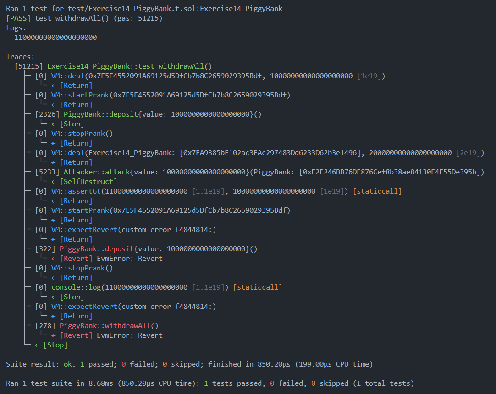

**Exercise 15:** DOS attack can be executed by passing a very large number for `_numberOfRounds` in `WinnerTakesAll::createNewRounds()`. A lot of gas will be required to execute `WinnerTakesAll::clearNewRounds()` to delete the rounds. 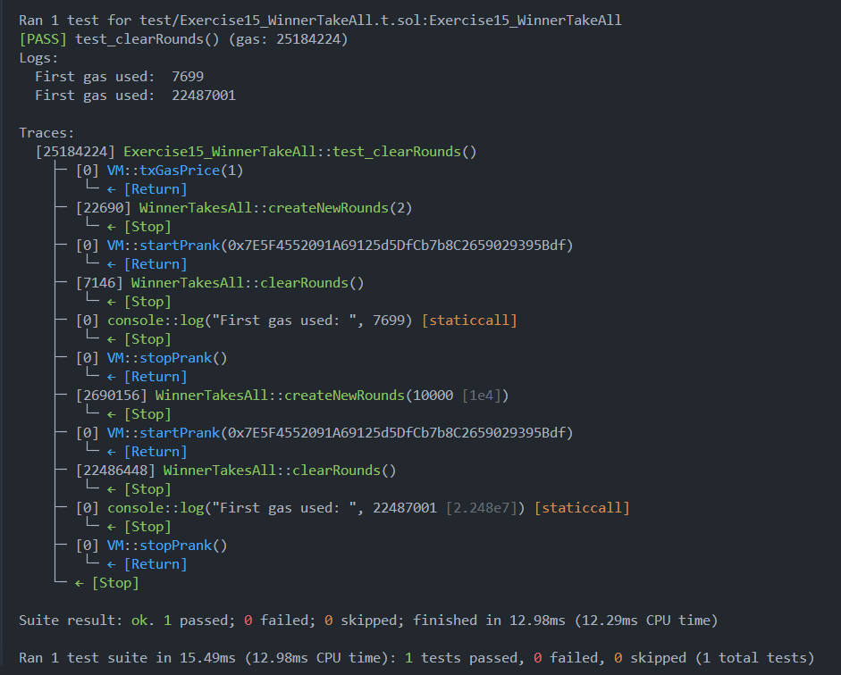
